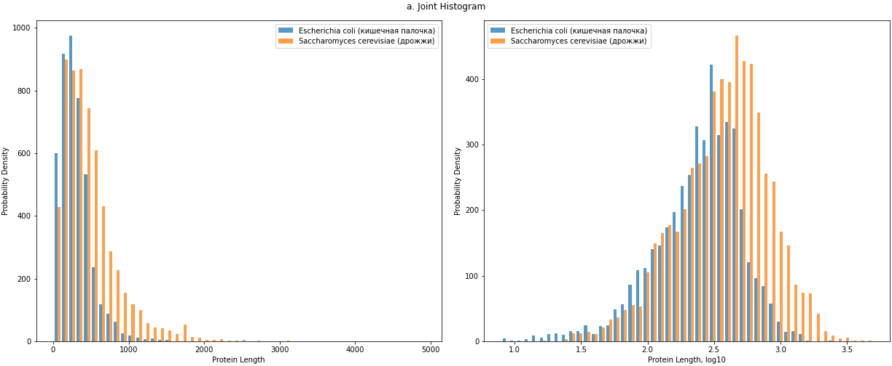
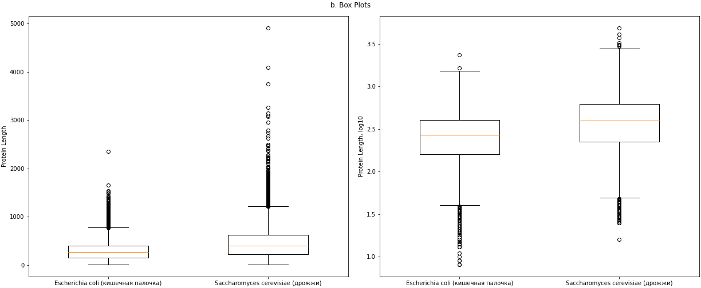
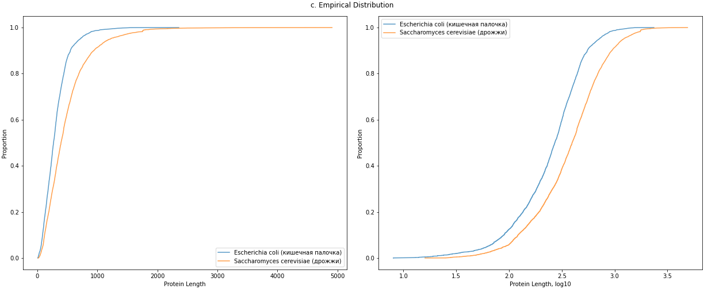

# Applied Statistics / Home Work

## Reproducibility

| OS     | Windows/Linux |
| -----  | ------------- |
| Python | 3.7.7         |
| pip    | 21.1.2        |

### Dependencies:
```bash
pip install -r requirements.txt
```

### Run:
```bash
python main.py
```

&nbsp;
## Plots

### a. Joint Histogram


### b. Box Plots


### c. Empirical Distribution

